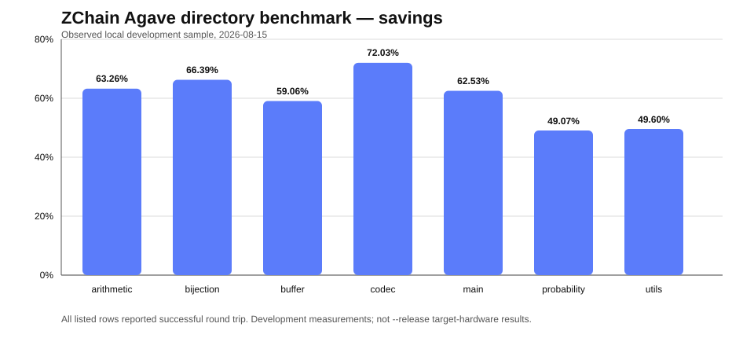
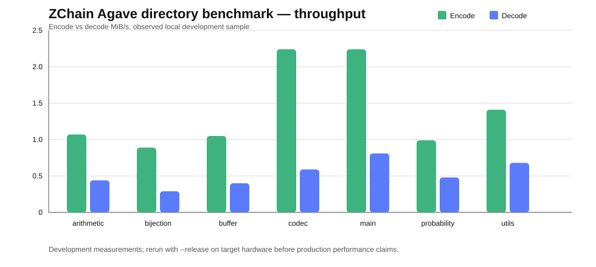
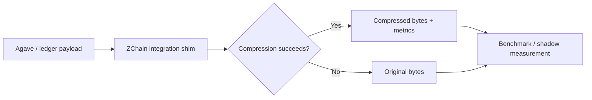
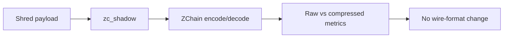

# ZChain

**Experimental compression integration for blockchain and validator infrastructure.**

ZChain is Zetako's proprietary compression technology for structured blockchain and infrastructure payloads. This public repository is a **technical showcase**: it documents benchmark methodology, public metrics, and integration models while keeping the proprietary core source and release artifacts private.

The current public focus is an **Agave integration prototype** with fail-open behavior, SHA-256 round-trip verification, file/directory benchmark tooling, and an optional shred shadow probe that can measure compression without changing the wire format.

> **Current status:** validated development integration and reproducible local benchmarks. Not production-ready yet.

---

## Agave integration snapshot

The current Agave-facing integration includes:

- `compression/api` — small codec trait used by Agave-facing code
- `compression/zchainv3` — ZChain v3 Rust codec adapter
- `ledger/src/compression.rs` — fail-open compression shims plus benchmark metrics
- `tools/zchain-bench` — single-file round-trip benchmark
- `tools/zchain-bench-dir` — directory benchmark with CSV output
- `ledger/src/zc_shadow.rs` — optional shadow probe for shred payload measurements without changing network behavior

The benchmark layer records raw/compressed size, ratio, savings, encode/decode timing, MiB/s throughput, SHA-256 integrity, and configurable buffer behavior.

---

## Verified local benchmark example

Observed locally on **2026-08-15**:

| Input | Raw bytes | ZChain bytes | Ratio | Savings | Encode | Decode | Integrity |
|---|---:|---:|---:|---:|---:|---:|---|
| `ZChain_Benchmark_Report.md` | 6,000 | 2,887 | 0.4812 | **51.88%** | 4.712 ms | 4.635 ms | **SHA-256 OK** |

These are **development measurements**, not tuned `--release` numbers and not validator-production claims.

---

## Directory benchmark sample



| File | Savings | Encode MiB/s | Decode MiB/s | Round trip |
|---|---:|---:|---:|---|
| `arithmetic.rs` | 63.26% | 1.07 | 0.44 | OK |
| `bijection.rs` | 66.39% | 0.89 | 0.29 | OK |
| `buffer.rs` | 59.06% | 1.05 | 0.40 | OK |
| `codec.rs` | 72.03% | 2.24 | 0.59 | OK |
| `main.rs` | 62.53% | 2.24 | 0.81 | OK |
| `probability.rs` | 49.07% | 0.99 | 0.48 | OK |
| `utils.rs` | 49.60% | 1.41 | 0.68 | OK |



---

## Integration model



### Shadow measurement path



The **fail-open** path is intentional for experimentation: compression errors return the original bytes rather than failing validator paths.

---

## Public use cases

### Shred payload shadow measurements
Measure raw-vs-ZChain behavior on ledger shred payloads without changing network behavior.

### Blockstore storage experiments
Compare compressed payload size against raw payload size before enabling any write path.

### Validator artifacts
Run the directory benchmark against captured validator logs, JSON, or other structured artifacts and publish CSV metrics for savings, throughput, and round-trip status.

---

## Reproducible commands

```bash
cd agave
./cargo check -p solana-ledger --features zchainv3
./cargo check -p zchain-bench --features zchainv3
./cargo check -p zchain-bench-dir --features zchainv3

./cargo run -p zchain-bench --features zchainv3 -- ../ZChain_Benchmark_Report.md
./cargo run -p zchain-bench-dir --features zchainv3 -- ../zchainv3-rs-full/src /tmp/zchain-src-bench.csv
```

See [docs/zchain-agave-benchmarks.md](docs/zchain-agave-benchmarks.md) for the full benchmark note.

---

## Public claims and limits

### Supported by the current evidence

- Agave-facing ZChain v3 integration compiles under the documented feature flag.
- Single-file and directory round-trip benchmark tooling is available.
- SHA-256 round-trip integrity is reported by the benchmark path.
- The documented single-file test produced **51.88% savings** with SHA-256 OK.
- The documented seven-file directory sample produced **49.07% to 72.03% savings**, with round-trip OK for every listed row.
- The integration is fail-open by design.
- A shadow probe can measure shred payload compression without changing the wire format.

### Not claimed yet

- Production-ready Agave integration
- Production validator throughput
- Mainnet performance or network-wide bandwidth savings
- Release-optimized benchmark numbers
- Wire-format compatibility for an enabled compressed transport path

The current port still emits `unused_imports` and `static_mut_refs` warnings. They are not blocking the documented benchmarks, but they should be cleaned before production-readiness claims.

---

## Public vs. private

**Public here**

- benchmark methodology
- benchmark results
- integration architecture
- technical claims that can be externally reviewed

**Private**

- proprietary compression core source
- release binaries and protected builds
- internal datasets and test infrastructure
- customer-specific integrations

---

## Documentation

- [Agave Benchmarks](docs/zchain-agave-benchmarks.md)
- [Agave Architecture](docs/AGAVE_INTEGRATION.md)
- [Public Claims](docs/PUBLIC_CLAIMS.md)
- [Legacy benchmark report](ZChain_Benchmark_Report.md)

For technical evaluation, partnership, or licensing discussions: **contact@zetako.ai**

© Zetako. Proprietary technology. Public documentation in this repository does not grant rights to reproduce, reverse engineer, or redistribute the ZChain implementation.
