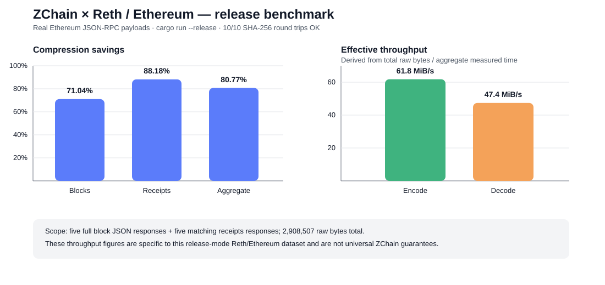
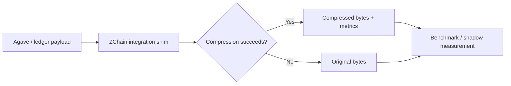
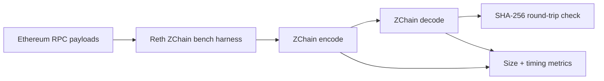

# ZChain

**Lossless compression experiments for blockchain clients, validator infrastructure, and execution-layer data.**

ZChain is Zetako's proprietary compression technology for structured blockchain and infrastructure payloads. This public repository is a **technical showcase**: it documents reproducible benchmark methodology, integration models, and externally reviewable metrics while keeping the proprietary core source and release artifacts private.

The current public evidence covers two Rust blockchain stacks:

- **Reth / Ethereum** — standalone **release-mode** benchmark harness on real Ethereum JSON-RPC block and receipt payloads.
- **Agave / Solana** — validated development integration with fail-open shims, benchmark tooling, and an optional shred shadow probe.

> **Performance policy:** ZChain speed claims are published only when the benchmark scope is representative. Initial Agave development-build throughput figures are explicitly excluded from ZChain performance claims. The Reth figures below come from `cargo run --release`.

---

# Reth / Ethereum — release benchmark

The Reth experiment adds a standalone benchmark harness under:

```text
tools/reth-zchain-bench/
```

It benchmarks real Ethereum JSON-RPC payloads outside the Reth node runtime before touching networking, storage, or sync paths.

The dataset contains five `eth_getBlockByNumber` responses with full transactions and five matching `eth_getBlockReceipts` responses.

## Observed release results — 2026-08-15

| Payload | Files | Raw bytes | ZChain bytes | Ratio | Savings | Encode | Decode | Round trip |
|---|---:|---:|---:|---:|---:|---:|---:|---|
| `eth_getBlockByNumber` | 5 | 1,256,590 | 363,968 | 0.2896 | **71.04%** | 31.578 ms | 39.715 ms | **5/5 OK** |
| `eth_getBlockReceipts` | 5 | 1,651,917 | 195,266 | 0.1182 | **88.18%** | 13.306 ms | 18.803 ms | **5/5 OK** |
| **Total** | **10** | **2,908,507** | **559,234** | **0.1923** | **80.77%** | **44.884 ms** | **58.518 ms** | **10/10 OK** |

### Effective throughput from the aggregate release run

Calculated from total raw bytes divided by aggregate measured time:

- **Encode: ~61.8 MiB/s**
- **Decode: ~47.4 MiB/s**

These are **derived effective throughput figures for this specific Reth/Ethereum JSON-RPC dataset and release run**. They are not universal ZChain throughput guarantees.



### What the Reth benchmark demonstrates

- release-mode ZChain execution on a Rust blockchain-client codebase;
- strong compression on real Ethereum execution-layer JSON payloads;
- **10/10 SHA-256 verified round trips**;
- **71.04% savings** on full block JSON in the measured sample;
- **88.18% savings** on receipts JSON in the measured sample;
- **80.77% aggregate savings** across the ten measured payloads.

See [Reth / Ethereum Benchmarks](docs/zchain-reth-benchmarks.md) for methodology and next integration steps.

---

# Agave / Solana — integration prototype

The Agave-facing integration includes:

- `compression/api` — codec trait used by Agave-facing code
- `compression/zchainv3` — ZChain v3 Rust codec adapter
- `ledger/src/compression.rs` — fail-open compression shims plus benchmark metrics
- `tools/zchain-bench` — single-file round-trip benchmark
- `tools/zchain-bench-dir` — directory benchmark with CSV output
- `ledger/src/zc_shadow.rs` — optional shadow probe for shred payload measurements without changing network behavior

## Agave performance boundary

The **initial Agave timing/throughput measurements were produced through development-build benchmark commands, not release-mode codec-isolation tests**. They are therefore **not representative of ZChain codec throughput and are excluded from public ZChain speed claims**.

The Agave integration remains valuable as an integration and measurement proof:

- feature-gated Agave components compile;
- fail-open behavior protects validator paths during experimentation;
- SHA-256 round-trip verification is built into the benchmark path;
- a shadow probe can measure shred payload behavior without changing the wire format;
- compression savings can be studied before enabling any compressed transport or storage path.

A future Agave performance publication must isolate codec cost from harness/integration overhead and run in `--release` mode on representative validator hardware.

## Verified Agave compression examples

| Scope | Observed savings | Integrity |
|---|---:|---|
| Single-file `ZChain_Benchmark_Report.md` | **51.88%** | SHA-256 OK |
| Seven-file Rust source sample | **49.07% to 72.03%** | all listed rows OK |


See [Agave Benchmarks](docs/zchain-agave-benchmarks.md) and [Agave Architecture](docs/AGAVE_INTEGRATION.md).

---

# Integration architecture

## Fail-open Agave path



## Reth benchmark path



---

# Public claims and limits

## Supported by current evidence

### Reth / Ethereum

- The benchmark runs with `cargo run --release`.
- The documented dataset contains ten real Ethereum JSON-RPC payloads.
- All ten documented payloads pass SHA-256 round-trip verification.
- Aggregate measured savings are **80.77%** on the documented dataset.
- Aggregate measured encode/decode times are **44.884 ms / 58.518 ms**.
- Derived effective throughput for that aggregate run is approximately **61.8 MiB/s encode / 47.4 MiB/s decode**.

### Agave / Solana

- The ZChain v3 Agave-facing integration builds under the documented feature flag.
- Single-file and directory round-trip tooling exists.
- The integration is fail-open by design.
- The shred shadow path measures compression without changing the wire format.
- The current public Agave evidence supports compression/integration claims, **not speed claims** from the initial development run.

## Not claimed yet

- Production-ready Agave or Reth node integration
- Mainnet-wide bandwidth reduction
- Release-mode Agave validator throughput
- Real shred-traffic savings until representative shadow datasets are collected
- Wire-format compatibility for an enabled compressed transport path
- Universal ZChain throughput independent of payload type, hardware, or integration context

---

# Public vs. private

**Public here**

- benchmark methodology
- verified benchmark results
- integration architecture
- public claim boundaries
- reproducible commands and experiment design

**Private**

- proprietary compression core source
- protected release binaries/builds
- internal datasets and test infrastructure
- customer-specific integrations

---

# Documentation

- [Reth / Ethereum Benchmarks](docs/zchain-reth-benchmarks.md)
- [Agave Benchmarks](docs/zchain-agave-benchmarks.md)
- [Agave Architecture](docs/AGAVE_INTEGRATION.md)
- [Public Claims](docs/PUBLIC_CLAIMS.md)
- [Legacy benchmark report](ZChain_Benchmark_Report.md)

For technical evaluation, partnership, or licensing discussions: **contact@zetako.ai**

© Zetako. Proprietary technology. Public documentation in this repository does not grant rights to reproduce, reverse engineer, or redistribute the ZChain implementation.