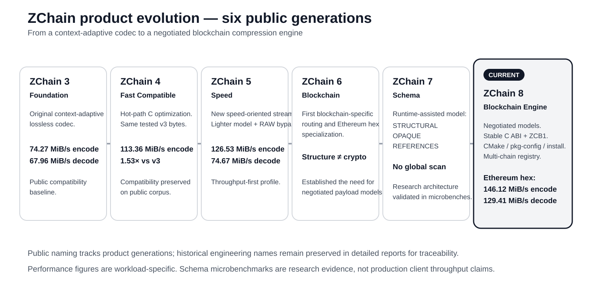
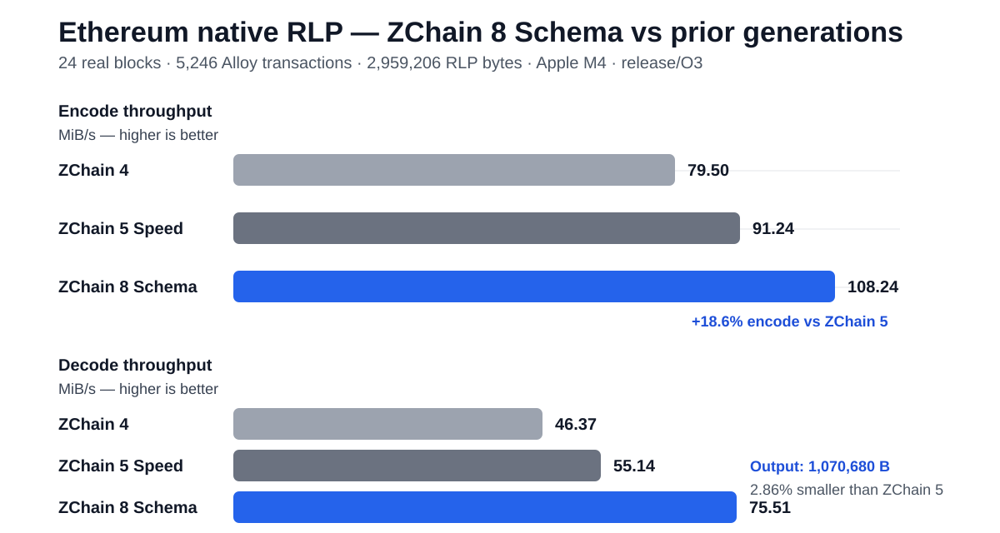

# ZChain

**A blockchain-native compression engine with negotiated models for each serialization family.**

ZChain is Zetako's proprietary lossless compression technology for blockchain data paths. This public repository documents the **evolution of the product**, benchmark methodology, blockchain-specific use cases, reproducible results, and the boundary between measured evidence and future integration work.

ZChain is not being developed as a generic “compress everything” library. A blockchain runtime already knows whether it is handling a block, receipt, RLP payload, signature, account key or consensus result. The product direction is to use that knowledge instead of spending CPU rediscovering it.

> **Goal:** reduce bytes moved or stored by blockchain infrastructure while keeping reconstruction exact and processing cost low enough for the path being optimized.

---

## Product evolution — from v3 to the Blockchain Engine

The public history is intentionally visible. Each generation exists because the previous one exposed a concrete limitation.



| Public generation | Engineering name | What changed | Evidence / delta |
|---|---|---|---|
| **ZChain 3 — Foundation** | v3 | Original context-adaptive lossless codec | Public compatibility baseline |
| **ZChain 4 — Fast Compatible** | v4 | C hot-path optimization without changing tested v3 output | **74.27 → 113.36 MiB/s encode** on the 64-file public corpus; same compressed byte count |
| **ZChain 5 — Speed** | Speed_First | New speed-oriented stream, lighter model, RAW bypass | **126.53 MiB/s encode / 74.67 MiB/s decode** on the same corpus |
| **ZChain 6 — Blockchain** | ZCB2 / blockchain profiles | First blockchain-specific routing and Ethereum hex specialization | Established that crypto-heavy fields should not always be treated like ordinary structured bytes |
| **ZChain 7 — Schema** | ZCB3 | Runtime-assisted structure / opaque / reference model | Architecture validated in schema-assisted research microbenchmarks |
| **ZChain 8 — Blockchain Engine** | current engine | Negotiated models, stable public C ABI, ZCB1 frames, installable SDK, multi-chain registry and direct serializer adapters | **Native Ethereum RLP schema model now SUPPORTED** |

### The change in architecture

```text
v3 / v4
structured bytes
      ↓
context model + arithmetic coding

Speed
      ↓
same concept, optimized for throughput

Blockchain
      ↓
payload-aware profiles

Schema
      ↓
structure | opaque crypto | known references

Blockchain Engine
      ↓
negotiated model selected by the blockchain runtime
```

The product therefore evolved from a standalone codec into a **blockchain compression engine with explicit integration contracts**.

---

## Native Ethereum milestone — direct Alloy/Reth schema model

`ETHEREUM_SCHEMA` is now **SUPPORTED** through a direct Alloy/Reth-compatible adapter. The adapter works from native Alloy transaction objects and calls `zchain_bc_stream_*` directly — **no `.ops` replay file and no RLP parser inside the timed codec path**.

Reference corpus:

- **24 real Ethereum blocks**;
- **5,246 native Alloy transactions**;
- legacy, EIP-1559, EIP-4844 blob and EIP-7702 transaction mix;
- **2,959,206 native RLP bytes**.

### Same-RLP comparison

| Codec | Output bytes | Savings | Encode | Decode |
|---|---:|---:|---:|---:|
| ZChain 4 — Fast Compatible | 1,102,352 | 62.75% | 79.50 MiB/s | 46.37 MiB/s |
| ZChain 5 — Speed | 1,102,219 | 62.75% | 91.24 MiB/s | 55.14 MiB/s |
| ZChain 8 — `ethereum-rlp` compatible | 1,102,352 | 62.75% | 74.23 MiB/s | 46.12 MiB/s |
| **ZChain 8 — `ETHEREUM_SCHEMA`** | **1,070,680** | **63.82%** | **108.24 MiB/s** | **75.51 MiB/s** |

Against ZChain 5 Speed on the same RLP bytes, ZChain 8 Schema is **2.86% smaller**, **18.6% faster to encode**, and **36.9% faster to decode** in codec-only mode.



The end-to-end adapter measurement is reported separately: **58.28 MiB/s serializer→frame encode** and **74.02 MiB/s decode**. This keeps codec throughput distinct from Alloy serialization and span-marking cost.

[Open the direct Alloy/Reth supported benchmark →](docs/ZCHAIN_8_ETHEREUM_SCHEMA_DIRECT_ALLOY_SUPPORTED_REPORT.md)

---

## Latest multi-chain reference run

The existing Apple M4 native C reference run remains the current public summary for Ethereum JSON, Solana RPC, CometBFT and Agave ledger-source payloads.

| Corpus | Payload | Raw bytes | ZChain bytes | Savings | Encode | Decode |
|---|---|---:|---:|---:|---:|---:|
| **Ethereum Reth JSON** | `ethereum-hex` | 2,908,507 | **512,808** | **82.37%** | **131.11 MiB/s** | **114.69 MiB/s** |
| Ethereum Reth JSON | `ethereum-block` | 2,908,507 | 559,234 | 80.77% | 91.83 MiB/s | 57.70 MiB/s |
| **Solana mainnet RPC JSON** | `solana-rpc` | 26,106,696 | **4,493,986** | **82.79%** | **110.40 MiB/s** | **67.93 MiB/s** |
| **CometBFT CosmosHub RPC JSON** | `cometbft` | 968,332 | **295,048** | **69.53%** | **67.29 MiB/s** | **43.19 MiB/s** |
| **Agave ledger source** | `solana-shred` | 879,258 | **222,165** | **74.73%** | **81.81 MiB/s** | **54.38 MiB/s** |

[Open the full multi-chain M4 benchmark report →](docs/ZCHAIN_BLOCKCHAIN_C_1_2_0_M4_BENCH_REPORT.md)

---

## Ethereum JSON specialization

The negotiated `ETHEREUM_HEX` profile remains the supported model for Reth Ethereum JSON payloads.

| Path | Raw bytes | Final bytes | Savings | Encode | Decode |
|---|---:|---:|---:|---:|---:|
| Previous `ethereum-block` path | 2,908,507 | 559,234 | 80.77% | 91.83 MiB/s | 57.70 MiB/s |
| **Negotiated `ethereum-hex`** | **2,908,507** | **512,808** | **82.37%** | **131.11 MiB/s** | **114.69 MiB/s** |

On this run, the negotiated specialization is **8.30% smaller**, **1.43× faster to encode**, and **1.99× faster to decode** than the previous Ethereum path.

[Read the Ethereum page →](docs/ETHEREUM.md)

---

## Blockchain pages

Every page answers the same questions: **what do we compress, why does it matter, how is it measured, what is proven today, and what comes next?**

| Ecosystem | Current public status | Page |
|---|---|---|
| **Ethereum / Reth** | `ETHEREUM_HEX` and direct Alloy/RLP `ETHEREUM_SCHEMA` **SUPPORTED** | [Ethereum](docs/ETHEREUM.md) |
| **EVM L2 / EVM-compatible** | Ethereum JSON-hex model reusable; chain-specific benches pending | [EVM L2](docs/EVM_L2.md) |
| **Solana** | Real mainnet RPC corpus measured; RPC profile supported | [Solana](docs/SOLANA.md) |
| **Agave** | Ledger-source profile measured; validator-side schema integration remains research | [Agave](docs/AGAVE.md) |
| **Cosmos / CometBFT** | Real CosmosHub RPC corpus measured; CometBFT profile supported | [Cosmos / CometBFT](docs/COSMOS_COMETBFT.md) |
| **Bitcoin** | Native block / transaction baseline established; specialized model next | [Bitcoin](docs/BITCOIN.md) |
| **Substrate / Cardano / Sui / Aptos / TRON / others** | Adapter-ready or research models | [Model matrix](docs/MODEL_MATRIX.md) |

---

## What ZChain can optimize

Depending on the chain and integration boundary, the recurring targets are:

- **RPC responses** — blocks, receipts, transactions, traces, account data;
- **native serialization** — RLP and other chain-specific byte formats where the runtime already knows field identity;
- **storage and archive paths** — blocks, receipts, snapshots, exports, indexer datasets;
- **state sync / snapshot movement** — large structured batches where byte reduction can offset codec CPU;
- **service-to-service transfer** — when an explicit negotiated format is appropriate;
- **validator or execution-client sidecars** — shadow measurement before changing a critical path.

Compression savings on a benchmark payload are **not automatically equivalent to mainnet bandwidth or database savings**. Production claims require measurement in the actual path.

---

## Model maturity

ZChain uses explicit maturity labels:

- **SUPPORTED** — specialized model with real-corpus evidence and an integration contract;
- **ADAPTER_READY** — serialization/integration boundary is defined, but specialized real-corpus validation is still required;
- **RESEARCH** — active model work or architecture experiment.

[Open the model matrix →](docs/MODEL_MATRIX.md)

---

## Benchmark methodology

Public benchmark pages follow the same rules:

1. lossless byte-for-byte round trip;
2. exact workload and serialization named;
3. native codec timing separated from I/O, hashing and process startup;
4. compression and decompression throughput reported separately;
5. serializer→frame measurements reported separately from codec-only throughput;
6. build profile and hardware stated;
7. synthetic architecture tests labeled as synthetic;
8. no chain-specific production claim without a real chain-specific corpus.

[Benchmark methodology →](docs/METHODOLOGY.md)

---

## ZChain vs established codecs

ZChain is compared against selected established codecs — currently **gzip, Brotli and LZMA2** — on the same documented payloads and named presets.

The comparison focuses on the tradeoff that matters for blockchain infrastructure: **compressed bytes versus encode/decode cost**.

[Open the codec comparison →](docs/COMPRESSION_COMPARISON.md)

---

## Repository structure

```text
/
├── README.md                       product evolution and headline results
├── docs/
│   ├── ETHEREUM.md                 Ethereum / Reth
│   ├── EVM_L2.md                   Base / Arbitrum / Optimism / Polygon / BNB / Avalanche
│   ├── SOLANA.md                   Solana mainnet data
│   ├── AGAVE.md                    Agave validator integration
│   ├── COSMOS_COMETBFT.md          Cosmos / CometBFT
│   ├── BITCOIN.md                  Bitcoin model
│   ├── MODEL_MATRIX.md             serialization-family maturity
│   ├── METHODOLOGY.md              benchmark rules
│   ├── COMPRESSION_COMPARISON.md   ZChain vs other codecs
│   ├── ZCHAIN_8_ETHEREUM_SCHEMA_DIRECT_ALLOY_SUPPORTED_REPORT.md
│   └── evidence / legacy reports   detailed engineering evidence
└── assets/                         readable public charts
```

Detailed historical reports remain in the repository as evidence even when a shorter product-facing page links to them.

---

## Public vs private

**Published here:** methodology, benchmark reports, payload descriptions, product evolution, compatibility behavior, integration architecture and claim boundaries.

**Kept private:** proprietary codec core source, protected production releases, internal test infrastructure, unpublished datasets and customer-specific integrations.

For technical evaluation, partnership or licensing discussions: **contact@zetako.ai**

© Zetako. Proprietary technology. Public documentation in this repository does not grant rights to reproduce, reverse engineer or redistribute the protected ZChain implementation.