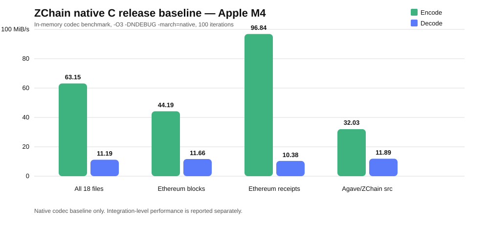

# ZChain

**Lossless compression experiments for blockchain clients, validator infrastructure, and execution-layer data.**

ZChain is Zetako's proprietary compression technology for structured blockchain and infrastructure payloads. This public repository is a **technical showcase**: it documents reproducible benchmark methodology, integration models, and externally reviewable metrics while keeping the proprietary core source and release artifacts private.

The current public evidence is deliberately split into three layers:

- **Native C release baseline** — in-memory codec benchmark, isolated from file I/O, process startup, CSV output, SHA hashing, and integration overhead.
- **Reth / Ethereum** — standalone `cargo run --release` benchmark on real Ethereum JSON-RPC block and receipt payloads.
- **Agave / Solana** — validated development integration with fail-open shims, benchmark tooling, and an optional shred shadow probe.

> **Performance policy:** native codec performance and integration-level performance are reported separately. Initial Agave development-build throughput figures are excluded from ZChain codec speed claims.

---

# Native C release baseline

A standalone C harness measures only in-memory ZChain encode/decode work and round-trip validation after loading all files before timing.

Release build:

```text
-O3 -DNDEBUG -march=native
```

Test system: **Apple M4, macOS Darwin 25.5.0 arm64**  
Dataset: **18 files, 2,942,777 raw bytes**  
Iterations: **100**

## Measured release results

| Dataset | Input bytes | ZChain bytes | Savings | Encode MiB/s | Decode MiB/s | Encode ns/byte | Decode ns/byte |
|---|---:|---:|---:|---:|---:|---:|---:|
| **All 18 files** | 2,942,777 | 572,658 | **80.54%** | **63.15** | **11.19** | 15.10 | 85.19 |
| Agave report markdown | 6,000 | 2,887 | 51.88% | 27.08 | 12.72 | 35.22 | 74.95 |
| Agave / ZChain sources | 28,270 | 10,537 | 62.73% | 32.03 | 11.89 | 29.77 | 80.24 |
| Ethereum block JSON | 1,256,590 | 363,968 | **71.04%** | **44.19** | 11.66 | 21.58 | 81.81 |
| Ethereum receipts JSON | 1,651,917 | 195,266 | **88.18%** | **96.84** | 10.38 | 9.85 | 91.91 |



### Current native baseline

- **63.15 MiB/s overall encode**
- **11.19 MiB/s overall decode**
- **80.54% overall savings**
- **96.84 MiB/s encode** on Ethereum receipts with **88.18% savings**
- **44.19 MiB/s encode** on Ethereum full block JSON with **71.04% savings**

The current decode path is materially slower than encode and is the clearest optimization target.

See [Native C Benchmark Report](docs/ZCHAIN_C_REAL_BENCH_REPORT.md) for p50/p95/p99 latency, debug-vs-release comparison, ns/byte, Cargo sanity checks, and methodology.

---

# Reth / Ethereum — release benchmark

The Reth experiment adds a standalone benchmark harness under:

```text
tools/reth-zchain-bench/
```

It benchmarks real Ethereum JSON-RPC payloads outside the Reth node runtime before touching networking, storage, or sync paths.

The dataset contains five `eth_getBlockByNumber` responses with full transactions and five matching `eth_getBlockReceipts` responses.

## Observed release results — 2026-08-15

| Payload | Files | Raw bytes | ZChain bytes | Ratio | Savings | Encode | Decode | Round trip |
|---|---:|---:|---:|---:|---:|---:|---:|---|
| `eth_getBlockByNumber` | 5 | 1,256,590 | 363,968 | 0.2896 | **71.04%** | 31.578 ms | 39.715 ms | **5/5 OK** |
| `eth_getBlockReceipts` | 5 | 1,651,917 | 195,266 | 0.1182 | **88.18%** | 13.306 ms | 18.803 ms | **5/5 OK** |
| **Total** | **10** | **2,908,507** | **559,234** | **0.1923** | **80.77%** | **44.884 ms** | **58.518 ms** | **10/10 OK** |

### Effective throughput from the aggregate Reth release run

Calculated from total raw bytes divided by aggregate measured time:

- **Encode: ~61.8 MiB/s**
- **Decode: ~47.4 MiB/s**

These are **dataset-specific effective integration-harness figures for this Reth/Ethereum release run**, not universal codec guarantees.


See [Reth / Ethereum Benchmarks](docs/zchain-reth-benchmarks.md) for methodology and next integration steps.

---

# Agave / Solana — integration prototype

The Agave-facing integration includes:

- `compression/api` — codec trait used by Agave-facing code
- `compression/zchainv3` — ZChain v3 Rust codec adapter
- `ledger/src/compression.rs` — fail-open compression shims plus benchmark metrics
- `tools/zchain-bench` — single-file round-trip benchmark
- `tools/zchain-bench-dir` — directory benchmark with CSV output
- `ledger/src/zc_shadow.rs` — optional shadow probe for shred payload measurements without changing network behavior

## Agave performance boundary

The **initial Agave timing/throughput measurements were produced through development-build benchmark commands, not release-mode codec-isolation tests**. They are therefore **not representative of ZChain native codec throughput and remain excluded from public ZChain speed claims**.

This distinction is now supported by an isolated native C release baseline showing materially higher codec throughput than the initial development-harness figures.

The Agave integration remains valuable as an integration and measurement proof:

- feature-gated Agave components compile;
- fail-open behavior protects validator paths during experimentation;
- SHA-256 round-trip verification is built into the benchmark path;
- a shadow probe can measure shred payload behavior without changing the wire format;
- compression savings can be studied before enabling any compressed transport or storage path.

A Cargo `--release` sanity check on `ZChain_Benchmark_Report.md` produced **51.88% savings**, 7.63 MiB/s encode, 5.88 MiB/s decode, and round-trip OK. This is an **integration-level release measurement**, not the native codec speed baseline.

## Verified Agave compression examples

| Scope | Observed savings | Integrity |
|---|---:|---|
| Single-file `ZChain_Benchmark_Report.md` | **51.88%** | SHA-256 OK |
| Seven-file Rust source sample | **49.07% to 72.03%** | all listed rows OK |


See [Agave Benchmarks](docs/zchain-agave-benchmarks.md) and [Agave Architecture](docs/AGAVE_INTEGRATION.md).

---

# What each benchmark means

| Evidence layer | Build / path | What it measures | Use for speed claims? |
|---|---|---|---|
| Native C baseline | `-O3 -DNDEBUG -march=native` | In-memory codec work, isolated from I/O/integration overhead | **Yes, with dataset/hardware scope** |
| Reth / Ethereum | `cargo run --release` | Release integration harness on real Ethereum JSON-RPC payloads | **Yes, as Reth dataset-specific effective throughput** |
| Agave initial harness | development/non-release | Integration + codec + harness overhead | **No** |
| Agave Cargo release sanity check | `cargo run --release` | Release integration-level single-file path | Yes, only as scoped integration measurement |

---

# Public claims and limits

## Supported by current evidence

### Native codec

- The isolated C release benchmark processes 18 files totaling 2,942,777 raw bytes.
- Measured aggregate performance is **63.15 MiB/s encode** and **11.19 MiB/s decode** on Apple M4.
- Aggregate measured savings are **80.54%**.
- Ethereum receipts reach **96.84 MiB/s encode** with **88.18% savings** in the documented corpus.
- Ethereum block JSON reaches **44.19 MiB/s encode** with **71.04% savings**.

### Reth / Ethereum

- The standalone benchmark runs with `cargo run --release`.
- The documented dataset contains ten real Ethereum JSON-RPC payloads.
- All ten documented payloads pass SHA-256 round-trip verification.
- Aggregate measured savings are **80.77%** on the documented dataset.

### Agave / Solana

- The ZChain v3 Agave-facing integration builds under the documented feature flag.
- Single-file and directory round-trip tooling exists.
- The integration is fail-open by design.
- The shred shadow path measures compression without changing the wire format.
- Initial Agave development-run speed figures are excluded from native ZChain performance claims.

## Not claimed yet

- Production-ready Agave or Reth node integration
- Mainnet-wide bandwidth reduction
- Production validator throughput
- Real shred-traffic savings until representative shadow datasets are collected
- Wire-format compatibility for an enabled compressed transport path
- Universal ZChain throughput independent of payload type, hardware, build flags, or integration context

---

# Public vs. private

**Public here**

- benchmark methodology
- verified benchmark results
- integration architecture
- public claim boundaries
- reproducible commands and experiment design

**Private**

- proprietary compression core source
- protected release binaries/builds
- internal datasets and test infrastructure
- customer-specific integrations

---

# Documentation

- [Native C Benchmark Report](docs/ZCHAIN_C_REAL_BENCH_REPORT.md)
- [Reth / Ethereum Benchmarks](docs/zchain-reth-benchmarks.md)
- [Agave Benchmarks](docs/zchain-agave-benchmarks.md)
- [Agave Architecture](docs/AGAVE_INTEGRATION.md)
- [Public Claims](docs/PUBLIC_CLAIMS.md)
- [Legacy benchmark report](ZChain_Benchmark_Report.md)

For technical evaluation, partnership, or licensing discussions: **contact@zetako.ai**

© Zetako. Proprietary technology. Public documentation in this repository does not grant rights to reproduce, reverse engineer, or redistribute the ZChain implementation.