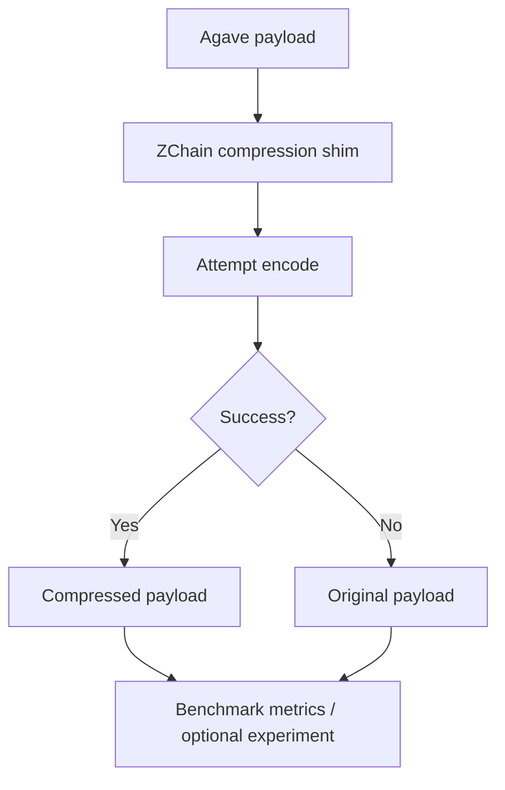
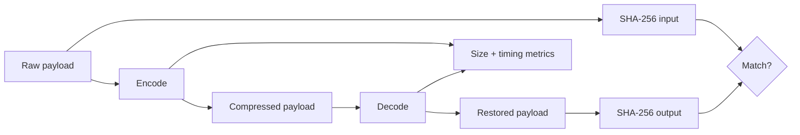
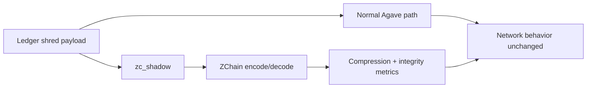

# ZChain × Agave Integration

This document presents the current public architecture of the ZChain v3 integration prototype for Agave.

The goal of the current integration is **measurement and engineering validation**. It is deliberately designed so ZChain can be evaluated without turning a development experiment into a validator-failure dependency.

> **Performance scope:** the initial Agave benchmark run used development/non-release commands and is not suitable for ZChain codec speed claims. Development-build timing and throughput are intentionally excluded from the public performance story. Agave-specific performance requires a release-mode, in-memory benchmark that isolates codec cost from harness and integration overhead.

## Integration components

| Component | Role |
|---|---|
| `compression/api` | Small codec trait used by Agave-facing code |
| `compression/zchainv3` | ZChain v3 Rust codec adapter |
| `ledger/src/compression.rs` | Fail-open shims and benchmark metrics |
| `tools/zchain-bench` | Single-file round-trip benchmark |
| `tools/zchain-bench-dir` | Directory benchmark with CSV output |
| `ledger/src/zc_shadow.rs` | Optional shred payload shadow probe |

## Fail-open processing model



The integration is currently **fail-open by design**: compression errors return the original bytes instead of failing validator paths.

## Benchmark metrics path

`ledger/src/compression.rs` exposes the benchmark-facing processing path used to collect metrics.

The metric set includes:

- raw bytes;
- compressed bytes;
- compression ratio;
- percentage savings;
- encode time;
- decode time;
- encode throughput;
- decode throughput;
- SHA-256 round-trip integrity;
- configurable buffer behavior.

The presence of timing/throughput instrumentation does **not** make every run publication-grade. Build profile, data path, harness overhead, and target hardware must be considered before speed is attributed to ZChain itself.



## Why the first Agave speed figures are excluded

The first public integration run used commands of the form:

```bash
./cargo run -p zchain-bench --features zchainv3 -- ...
./cargo run -p zchain-bench-dir --features zchainv3 -- ...
```

without `--release`.

Those results demonstrate integration behavior, compression savings, and round-trip verification, but **they do not isolate optimized codec throughput**. Potential contributors to the measured time include:

- Rust development-build code generation;
- integration/harness overhead;
- file and benchmark bookkeeping;
- SHA-256 and metrics work around the codec;
- non-isolated allocation/copy paths in the surrounding harness.

Therefore the initial Agave MiB/s values are excluded from ZChain performance claims.

This is a **measurement-scope limitation**, not evidence that ZChain itself runs at those development-build rates.

## Shred shadow probe

`ledger/src/zc_shadow.rs` provides an optional shadow path for measuring ZChain behavior on shred payloads.



The public value of this path is that it can measure compression behavior **without changing the wire format**.

## Current public use cases

### 1. Shred payload shadow measurement

Use the shadow probe to observe raw-vs-ZChain behavior on shred payloads while leaving normal network behavior unchanged.

### 2. Blockstore storage experiments

Use the fail-open ledger shims to compare compressed and raw payload sizes before enabling any storage write path.

### 3. Validator artifact benchmarking

Use `zchain-bench-dir` against captured validator artifacts and export CSV rows containing ratio, savings, timing, and round-trip status. Only release-mode, properly isolated timing should be promoted to public codec-speed claims.

## Validation commands completed

The current integration has been checked using:

```bash
./cargo check -p solana-ledger --features zchainv3
./cargo check -p zchain-bench --features zchainv3
./cargo check -p zchain-bench-dir --features zchainv3
./cargo run -p zchain-bench --features zchainv3 -- ../ZChain_Benchmark_Report.md
./cargo run -p zchain-bench-dir --features zchainv3 -- ../zchainv3-rs-full/src /tmp/zchain-src-bench.csv
```

These commands establish the current **development integration baseline**.

## Required Agave performance benchmark

The next publication-grade pass should use a release-mode codec-isolation path, for example:

```bash
cargo run --release -p zchain-bench --features zchainv3 -- ...
cargo run --release -p zchain-bench-dir --features zchainv3 -- ...
```

and preferably add an in-memory benchmark that reports:

- encode/decode MiB/s;
- ns/byte or cycles/byte where available;
- p50 / p95 / p99 latency;
- compression savings alongside each performance result;
- representative validator CPU/hardware details;
- codec-only timing separated from I/O, hashing, CSV, and harness overhead.

## Readiness boundary

The current integration should be described as a **validated development prototype**, not as production-ready validator infrastructure.

Known items still to address before stronger claims:

- clean `unused_imports` warnings in the current port;
- clean or redesign `static_mut_refs` usage;
- rerun benchmarks with `--release`;
- isolate codec timing from surrounding harness work;
- benchmark on target validator hardware;
- collect real shred-shadow datasets and publish reproducible aggregates;
- validate any future compressed write or transport path independently from the current shadow measurement path.
