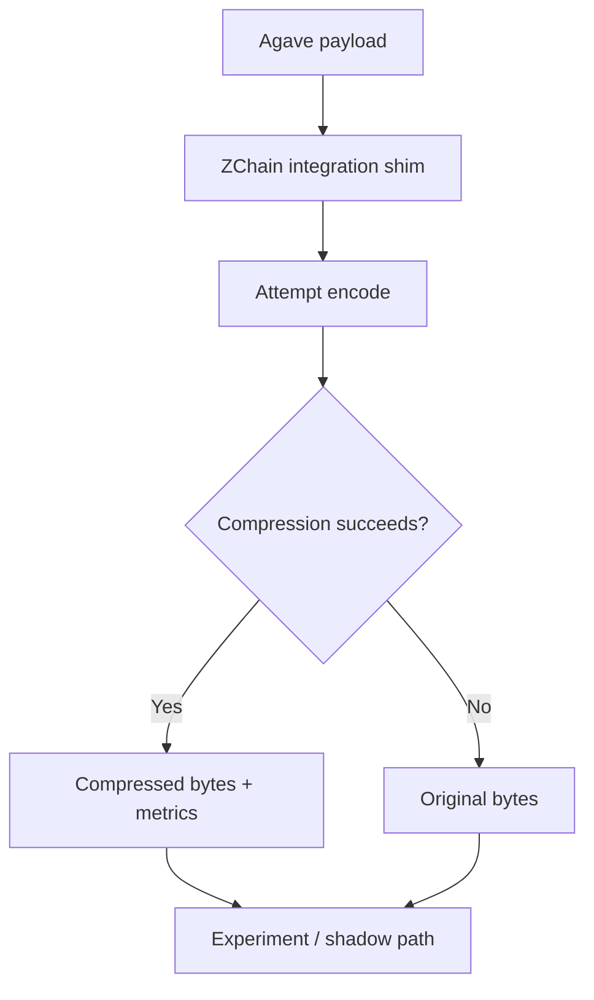
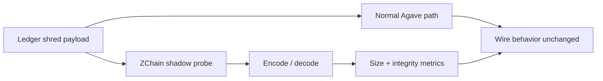

# Agave / Solana Validator — ZChain Integration Page

[← Documentation index](README.md) · [Product evolution](../README.md) · [Solana RPC benchmarks](SOLANA_MAINNET_BENCHMARKS.md)

This page documents the current **Agave-facing ZChain integration prototype**. Its purpose is engineering validation: expose safe integration points, measure compression behavior and collect evidence **before** making any production validator, storage or network claim.

## What is being integrated

The public Agave prototype includes:

| Component | Role |
|---|---|
| `compression/api` | codec trait used by Agave-facing code |
| `compression/zchainv3` | ZChain Rust adapter |
| `ledger/src/compression.rs` | fail-open compression shims and benchmark metrics |
| `tools/zchain-bench` | single-file round-trip benchmark |
| `tools/zchain-bench-dir` | directory benchmark with CSV output |
| `ledger/src/zc_shadow.rs` | optional shred payload shadow probe |

## Why Agave is a relevant integration target

A Solana validator handles latency-sensitive data paths, so a compression codec is only useful if the **byte savings justify the CPU cost and latency** in the exact path being considered.

The current integration is therefore designed to answer questions in stages:

1. Can the codec be called safely from Agave-facing code?
2. Are round trips lossless?
3. What savings are observed on representative payloads?
4. What is the isolated release-mode codec cost?
5. What changes when the codec is placed beside a real shred, blockstore or transport path?

This staged approach avoids turning an experiment into a validator failure dependency.

---

## Fail-open integration model



The current integration is **fail-open by design**: a compression failure returns the original bytes instead of failing the validator path.

### Why that matters

For early integration work, compression is an optimization rather than a correctness dependency. The fail-open design lets the team measure behavior while keeping the normal payload available.

---

## Shred shadow probe

`ledger/src/zc_shadow.rs` provides an optional measurement path for shred payloads.



The important property is that the current shadow probe can evaluate ZChain **without changing Agave's network wire format**.

This is the preferred way to collect real shred evidence before considering an enabled compressed transport path.

---

## What we currently measure

The integration tooling can record:

- raw and compressed bytes;
- compression ratio and savings;
- encode/decode timing;
- throughput;
- SHA-256 round-trip integrity;
- configurable buffer behavior.

The presence of timing instrumentation does not make every run suitable for a public codec-speed claim. Build profile, hashing, I/O, copying and harness overhead must be separated from the codec itself.

---

## Agave benchmark history

The first Agave benchmark commands were development/non-release runs:

```bash
./cargo run -p zchain-bench --features zchainv3 -- ...
./cargo run -p zchain-bench-dir --features zchainv3 -- ...
```

Those runs validated integration behavior and round trips, but their throughput is **not used as a ZChain codec-speed claim**.

A later Cargo release sanity check on the 6,000-byte benchmark report produced:

- **51.88% savings**;
- **7.63 MiB/s encode**;
- **5.88 MiB/s decode**;
- round trip **OK**.

This remains an **integration-level measurement**, not the native codec baseline.

Native C release measurements on Solana RPC payloads are documented separately and show materially higher codec throughput because they isolate in-memory codec work.

[See Solana native payload benchmarks](SOLANA_MAINNET_BENCHMARKS.md)

---

## Why the original development speed figures are excluded

The initial run did not isolate optimized codec time. Potential contributors included:

- Rust development-build code generation;
- integration and adapter overhead;
- file/benchmark bookkeeping;
- hashing and metrics work;
- allocation or copy behavior around the codec.

The correct public interpretation is therefore:

> **The first Agave run proved integration and lossless round trips. It did not establish native ZChain throughput.**

---

## Current use cases being evaluated

### 1. Shred shadow measurement

Observe raw-vs-compressed shred characteristics without changing network behavior.

### 2. Blockstore experiments

Measure whether selected stored payloads benefit enough from compression to justify CPU cost before enabling any write-path change.

### 3. Validator artifacts

Benchmark logs, JSON or other structured validator artifacts using the directory tooling.

### 4. Future transport experiment

Only after representative shadow data exists: evaluate an explicit compressed transport design with separate compatibility, latency and failure-mode validation.

---

## What ZChain could provide if integration economics are favorable

The potential advantages are straightforward:

- fewer bytes for selected validator data paths;
- reduced storage or transfer pressure where compression is appropriate;
- deterministic lossless reconstruction;
- an optional fast profile when both endpoints can deploy together;
- a compatibility-oriented profile when existing ZChain streams matter.

Whether those advantages outweigh CPU/latency cost must be demonstrated on the real Agave path.

---

## Readiness boundary

The current Agave work is a **validated development integration prototype**, not production-ready validator infrastructure.

Before a stronger claim, the integration should:

- clean remaining `unused_imports` warnings;
- clean or redesign `static_mut_refs` usage;
- isolate codec timing in release mode;
- benchmark on representative validator hardware;
- collect representative shred-shadow datasets;
- report p50/p95/p99 latency and throughput distributions;
- validate any enabled storage or transport path independently;
- test failure behavior and compatibility end-to-end.

---

## Related pages

- [Solana mainnet payload benchmarks](SOLANA_MAINNET_BENCHMARKS.md)
- [ZChain evolution: v3 → v4 → Speed_First](../README.md)
- [Public claims and measurement boundaries](PUBLIC_CLAIMS.md)
- [Native C benchmark methodology](ZCHAIN_C_REAL_BENCH_REPORT.md)
