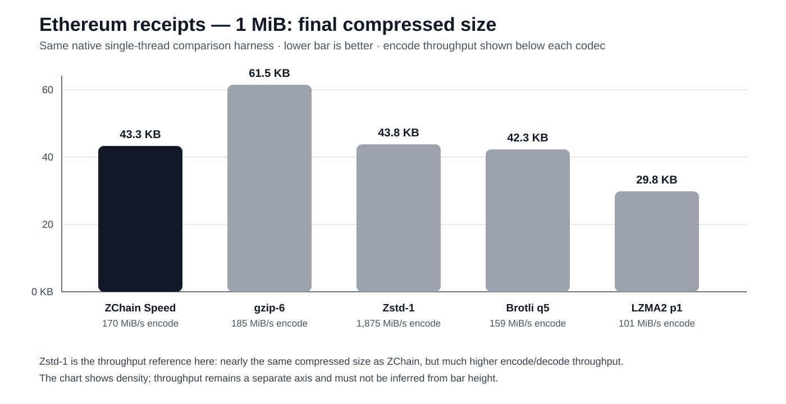

# ZChain vs Established Codecs — Selected Public Benchmarks

[← Documentation index](README.md) · [Product evolution](../README.md)

This is the dedicated public comparison page for **ZChain Speed_First** against selected established general-purpose codecs on structured blockchain-oriented payloads.

The comparison currently includes **gzip, Brotli and LZMA2/7zip**. Results are workload- and preset-specific; this page does not claim universal superiority across unrelated data types.

## What is being compared

For each workload we care about two independent outcomes:

1. **How many bytes remain after compression?**
2. **How much encode/decode throughput is required to get there?**

A codec that produces the smallest possible file is not automatically the best choice for a latency-sensitive blockchain path. Conversely, a very fast codec is not automatically useful if it leaves too many bytes on the wire or disk.

ZChain Speed_First is intended to explore that **compression-density / throughput balance**.

---

## Ethereum receipts — 1 MiB

Ethereum receipts are a particularly relevant structured workload: logs, addresses, topics, bloom filters and hexadecimal fields create repeated structure while still representing real execution-layer data.

| Codec | Final size | % original | Compression | Decompression |
|---|---:|---:|---:|---:|
| **ZChain Speed_First** | **43,318 B** | **4.13%** | **170 MiB/s** | **113 MiB/s** |
| gzip-1 | 74,316 B | 7.09% | 446 MiB/s | 1,292 MiB/s |
| gzip-6 | 61,489 B | 5.86% | 185 MiB/s | 1,495 MiB/s |
| Brotli q1 | 46,463 B | 4.43% | 1,279 MiB/s | 1,845 MiB/s |
| **Brotli q5** | **42,279 B** | **4.03%** | 159 MiB/s | 2,127 MiB/s |
| LZMA2 / 7zip p1 | **29,842 B** | **2.85%** | 101 MiB/s | 659 MiB/s |
| LZMA2 / 7zip p5 | 43,876 B | 4.18% | 12.6 MiB/s | 562 MiB/s |

### Against gzip-6

ZChain produces **43,318 B** versus **61,489 B** for gzip-6 — about **30% less compressed data** — while encode throughput remains close: **170 MiB/s vs 185 MiB/s**.

### Against Brotli q5

Brotli q5 produces **42,279 B**, only about **2.4% smaller** than ZChain's 43,318 B. In this test ZChain encodes slightly faster: **170 MiB/s vs 159 MiB/s**.

### Against LZMA2 / 7zip

LZMA2 preset 1 reaches the smallest output in this table at **29,842 B**, but ZChain encodes about **1.7× faster**.

At preset 5, LZMA2 produces a very similar final size to ZChain — **43,876 B vs 43,318 B** — while ZChain encodes about **13.5× faster**.

### What this workload says

On this receipts workload, ZChain sits in a useful middle ground: materially denser than gzip-6, nearly the same size as Brotli q5 at slightly higher encode throughput, and much faster than the LZMA2 p5 configuration while landing at a similar size.

Its decompression throughput is lower than the listed general-purpose codecs, which remains an important optimization area for latency-sensitive read-heavy paths.

---

## Large structured JSON — `blocks-4m`

This larger structured blockchain-style JSON workload shows a different part of the tradeoff.

| Codec | Final size | Encode |
|---|---:|---:|
| **ZChain Speed_First** | **165 KB** | **170 MiB/s** |
| gzip-6 | 334 KB | 105 MiB/s |
| Brotli q5 | 253 KB | 128 MiB/s |
| LZMA2 p1 | 227 KB | 67 MiB/s |

### Size result

ZChain produces approximately:

- **50% less data than gzip-6**;
- **35% less data than Brotli q5**;
- **27% less data than LZMA2 p1**.

### Encode result

ZChain is approximately:

- **1.62× faster than gzip-6**;
- **1.33× faster than Brotli q5**;
- **2.54× faster than LZMA2 p1**.

This is one of the strongest public ZChain examples because it combines **smaller output and higher encode throughput** than every listed configuration on the same workload.

---

## Why these comparisons matter for blockchain systems

Different blockchain paths value different tradeoffs:

| Use case | What usually matters most |
|---|---|
| RPC response generation | encode latency + bytes transferred |
| Receipt/log export | compression density + sustained throughput |
| Snapshot/archive creation | density may matter more than latency |
| Validator hot path | latency and CPU cost dominate; integration must be proven separately |
| Analytics/data movement | balance between bytes, encode throughput and decode throughput |

The benchmark therefore reports both **size** and **speed** instead of declaring one codec globally best.

---

## Methodology / reporting rules

When quoting this page publicly:

- name the exact workload;
- name the codec preset or quality level;
- keep compression and decompression throughput separate;
- do not extrapolate one structured blockchain result to unrelated datasets;
- use the exact measured values rather than generalized marketing numbers;
- distinguish native codec benchmarks from live blockchain integration results.

## Public conclusion

The selected evidence supports this scoped statement:

> **On the documented structured blockchain workloads, ZChain Speed_First can deliver a strong combination of compressed size and encode throughput relative to the listed gzip, Brotli and LZMA2/7zip configurations. The tradeoff varies by workload, and decode performance remains a separate consideration.**

---

## Related pages

- [Ethereum / Reth](zchain-reth-benchmarks.md)
- [Solana mainnet](SOLANA_MAINNET_BENCHMARKS.md)
- [Cosmos / CometBFT](COMETBFT_COSMOS_BENCHMARKS.md)
- [v3 → v4 → Speed_First](../README.md)
- [Public claims](PUBLIC_CLAIMS.md)
